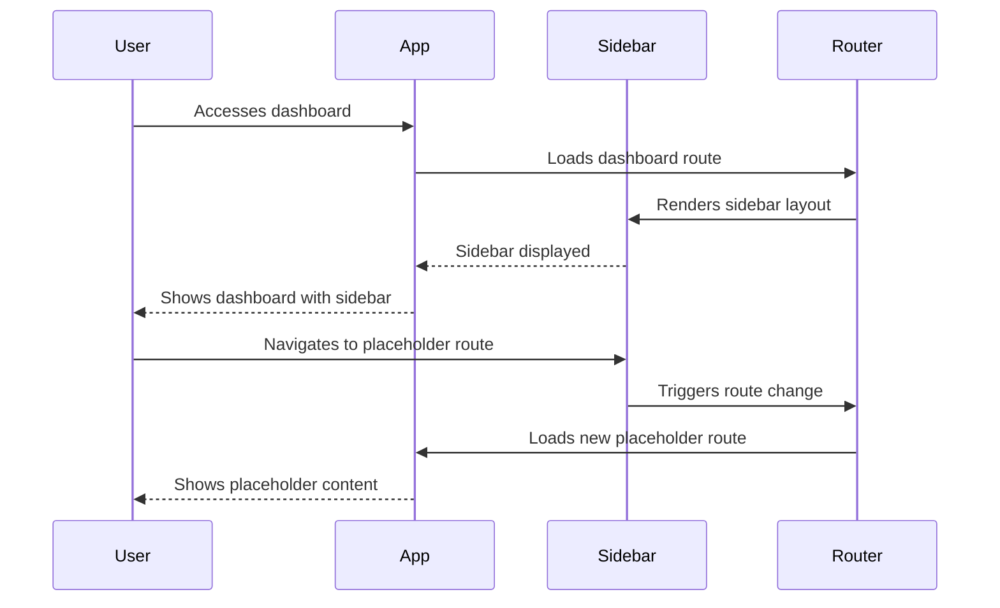

# Chapter 09: Sidebar Layout

## Overview
This chapter covers the implementation of a sidebar layout, including improvements to the file structure, creation of placeholder routes, and integration of the sidebar into the dashboard.

## Steps Completed
- Improved file structure for better maintainability
- Created placeholder routes for future features
- Implemented sidebar layout for dashboard navigation
- Updated README to reflect these changes
- Pushed changes to a new branch (`09`), created a PR, reviewed, and merged

## Sequence Diagram

## Notes
- The sidebar layout provides a consistent navigation experience.
- Placeholder routes allow for easy expansion of dashboard features.
