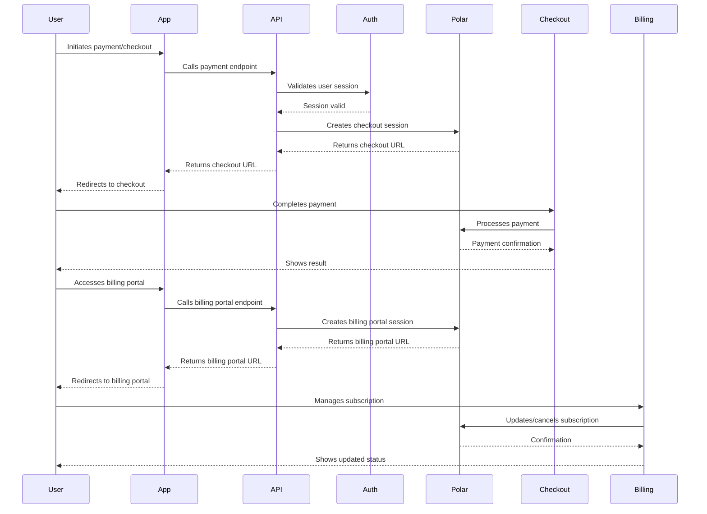

# Chapter 10: Payments

## Overview
This chapter covers the integration of payments using Polar, including checkout and billing portal flows, and connecting with authentication.

## Steps Completed
- Setup Polar for payment processing
- Integrated Polar with BetterAuth for secure user validation
- Created checkout flow for users
- Created billing portal for subscription management
- Pushed changes to a new branch (`10`), created a PR, reviewed, and merged

## Sequence Diagram

## Notes
- All sensitive payment logic is handled by Polar.
- User authentication is required for all payment and billing actions.
- The integration ensures a secure and seamless payment experience.
