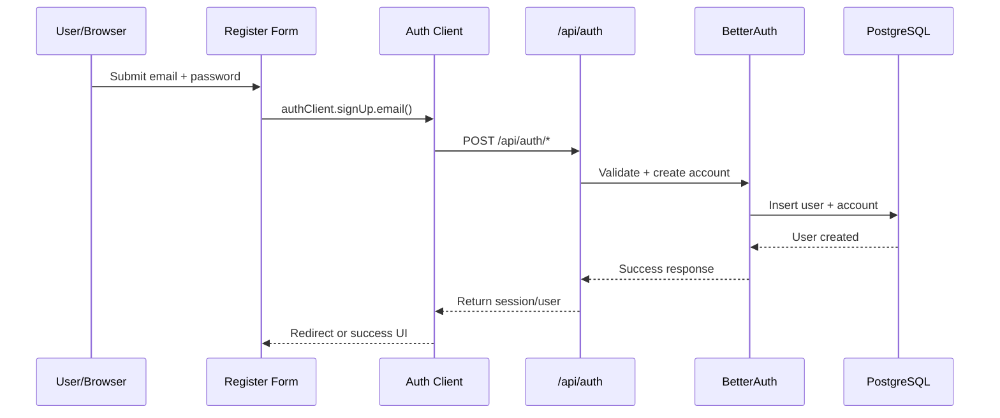
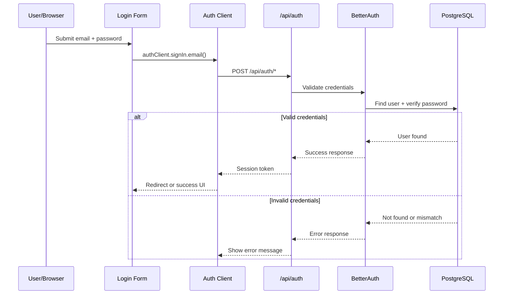
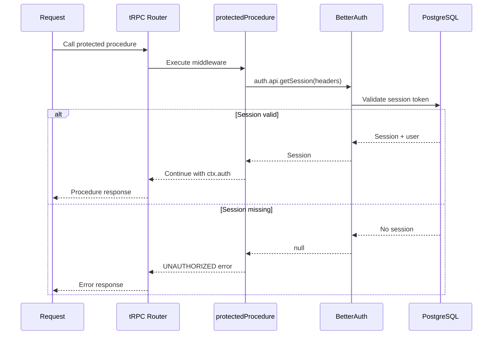
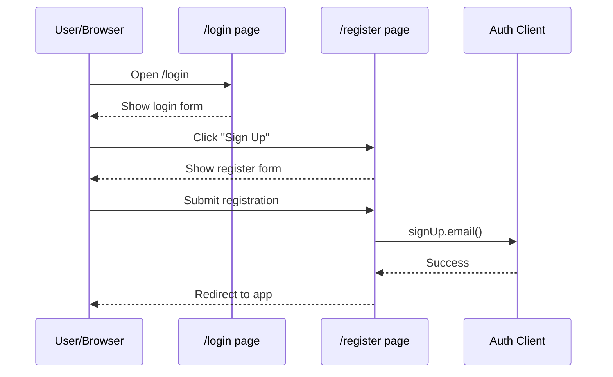
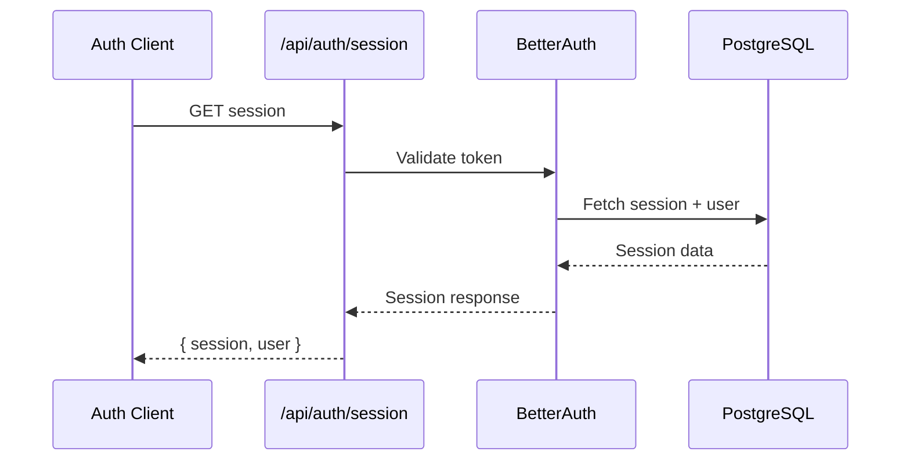

# Chapter 4: Authentication

This chapter documents the BetterAuth authentication setup, UI flows, and protected tRPC access.

## Overview

- BetterAuth configured with Prisma adapter in `src/lib/auth.ts`
- Auth API route handled at `src/app/api/auth/[...all]/route.ts`
- Auth client available in `src/lib/auth-client.ts`
- Login and register UI components in `src/features/auth/components`
- Protected tRPC access via `protectedProcedure` in `src/trpc/init.ts`

## Sequence Diagrams

### Sign Up Flow

### Sign In Flow

### Protected tRPC Procedure Flow

### Auth UI Navigation

### Session Validation

## Notes

- These diagrams reflect the current BetterAuth-based flow in the repo.
- If you add a dedicated tRPC auth router, update the protected flow to include those procedures.
