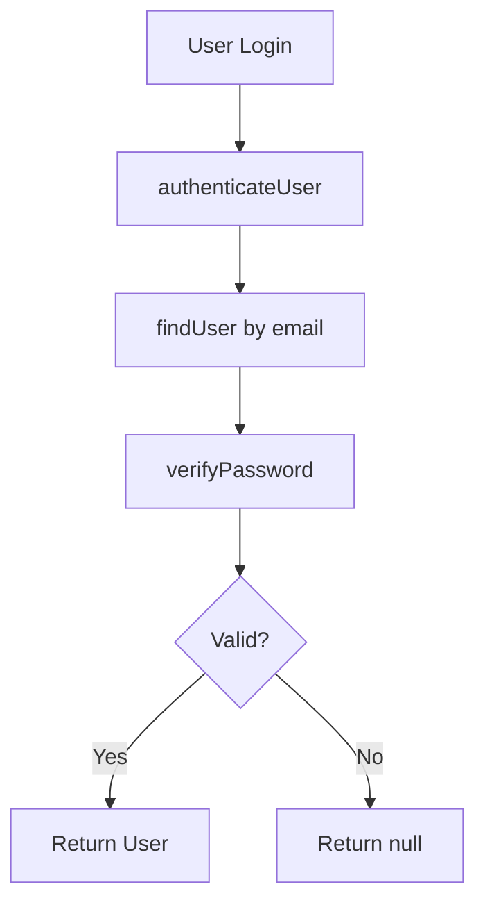
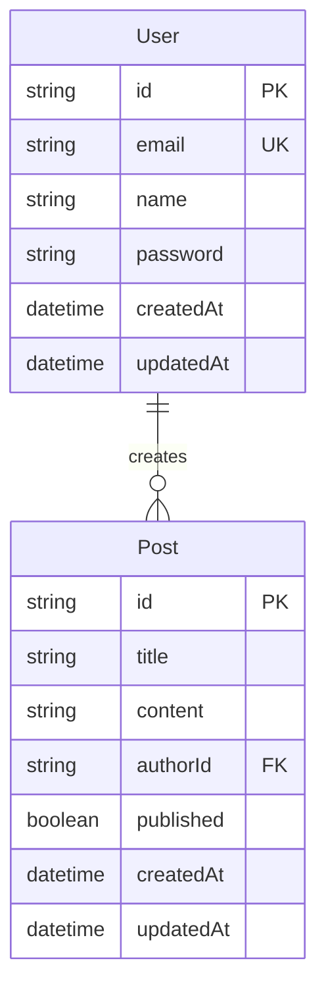

# CodeRabbit Integration Guide

This project uses **CodeRabbit** for automated code reviews, visualizations, and insights on every pull request.

## 🤖 What is CodeRabbit?

CodeRabbit is an AI-powered code review tool that automatically:
- 📊 Generates visual diagrams and flowcharts
- 📝 Creates comprehensive PR summaries
- 🔍 Reviews code for bugs, security issues, and best practices
- 💡 Provides actionable suggestions
- 🎨 Creates architecture visualizations

## 🚀 How It Works

### 1. When You Create a PR

CodeRabbit automatically:
1. Analyzes all changed files
2. Generates a high-level summary
3. Creates visual diagrams (architecture, database schema, flow charts)
4. Reviews code line-by-line
5. Adds comments with suggestions
6. Assigns a review status

### 2. What You Get

#### Visual Diagrams
- **Database Schema**: ER diagrams showing relationships
- **Architecture**: Component hierarchy and dependencies
- **Flow Charts**: Feature implementation flows
- **Sequence Diagrams**: API request/response flows

#### Code Review
- Security vulnerability detection
- Performance optimization suggestions
- Best practice recommendations
- Type safety improvements
- Code complexity analysis

#### Summary
- Changes overview with metrics
- Key technical decisions
- Breaking changes highlight
- Test coverage gaps
- Documentation updates needed

## 📋 Configuration

CodeRabbit is configured via `.github/coderabbit.yaml`:

```yaml
reviews:
  profile: chill
  high_level_summary: true
  poem: true  # Fun summary in poem format
  
custom_prompts:
  - focus on security, TypeScript, Next.js best practices
  - verify chapter objectives are met
  - generate visual diagrams
```

## 🎯 Getting Better Reviews

### 1. Write Good Commit Messages

```bash
# ✅ Good
feat(auth): add bcrypt password hashing

- Install bcrypt dependencies
- Create password utility functions
- Add auth helper functions
- Update security documentation

# ❌ Bad
fixed stuff
```

### 2. Fill Out PR Template

Complete all sections:
- Description
- Changes made
- Technical details
- Testing instructions
- Checklist items

### 3. Create Chapter Summaries

Include `CHAPTER_X_SUMMARY.md`:
- Helps CodeRabbit understand context
- Better diagram generation
- More accurate reviews

### 4. Add Code Comments

```typescript
/**
 * Hash a plaintext password using bcrypt
 * @param password - The plaintext password to hash
 * @returns Promise<string> - The hashed password
 */
export async function hashPassword(password: string): Promise<string> {
  return bcrypt.hash(password, SALT_ROUNDS);
}
```

## 💬 Interacting with CodeRabbit

### Asking Questions

In PR comments, tag CodeRabbit:
``````
@coderabbitai explain this change
@coderabbitai why is this a security issue?
@coderabbitai suggest alternatives
```

### Requesting Changes

``````
@coderabbitai review only the auth.ts file
@coderabbitai focus on security
@coderabbitai generate a sequence diagram for the login flow
```

### Resolving Comments

Reply to CodeRabbit's suggestions:
- ✅ "Fixed in [commit hash]"
- 💭 "Not applicable because..."
- 🤔 "Need more context on..."

## 📊 Understanding the Summary

### File Changes Section
```markdown
## Files Changed
- `src/lib/auth.ts` (+120, -0) - New authentication helper functions
- `src/lib/password.ts` (+25, -0) - Password hashing utilities
- `package.json` (+2, -0) - Added bcrypt dependencies
```

### Architecture Diagrams

CodeRabbit will generate mermaid diagrams:



### Security Insights

- 🔒 Password hashing implemented ✅
- 🔑 No hardcoded secrets ✅
- 🛡️ SQL injection protected (Prisma) ✅
- ⚠️ Rate limiting needed ⚠️

## 🎨 Example PR Review

When you create a PR for Chapter 2, CodeRabbit generates:

### High-Level Summary
```
This PR implements database layer with Prisma ORM and PostgreSQL.

Key Changes:
- Set up Prisma with schema for User and Post models
- Created type-safe database client
- Added password hashing with bcrypt
- Restructured to monorepo architecture

Security: ✅ Improved
Performance: ✅ Optimized (connection pooling)
Breaking Changes: ❌ None
```

### Database Schema Diagram


### Review Comments

CodeRabbit adds inline comments:
- "✅ Good use of bcrypt for password hashing"
- "💡 Consider adding rate limiting for auth endpoints"
- "🔒 Password properly excluded from user responses"
- "⚡ Prisma connection pooling configured correctly"

## 🏆 Best Practices

### DO:
- ✅ Create descriptive PR titles
- ✅ Fill out complete PR descriptions
- ✅ Respond to CodeRabbit suggestions
- ✅ Address security concerns immediately
- ✅ Keep PRs focused (one chapter at a time)

### DON'T:
- ❌ Ignore security warnings
- ❌ Skip PR template sections
- ❌ Create large, unfocused PRs
- ❌ Mark as "won't fix" without explanation
- ❌ Commit without proper commit messages

## 🔧 Troubleshooting

### CodeRabbit Not Commenting?

1. Check if CodeRabbit app is installed on repo
2. Verify `.github/coderabbit.yaml` exists
3. Ensure PR is not marked as draft (unless enabled)
4. Check file patterns aren't excluding your changes

### Want Different Review Style?

Update `.github/coderabbit.yaml`:
```yaml
reviews:
  profile: assertive  # More strict reviews
  # or
  profile: chill      # Gentler suggestions
```

### Need Specific Diagrams?

Ask in PR comment:
``````
@coderabbitai generate a sequence diagram for the user registration flow
@coderabbitai create an ER diagram showing all database relationships
```

## 📈 Metrics CodeRabbit Tracks

- **Complexity**: Cyclomatic complexity of functions
- **Coverage**: Test coverage gaps
- **Security**: Vulnerability detection
- **Performance**: Potential bottlenecks
- **Maintainability**: Code smell detection
- **Type Safety**: TypeScript issues

## 🎓 Learning from CodeRabbit

Each review is a learning opportunity:
- Read suggestions carefully
- Understand *why* something is recommended
- Apply learnings to future code
- Build better coding habits

## 🔗 Resources

- [CodeRabbit Documentation](https://docs.coderabbit.ai/)
- [CodeRabbit Review Instructions](https://docs.coderabbit.ai/guides/review-instructions/)
- [Conventional Commits](https://www.conventionalcommits.org/)
- [How to Write a Git Commit Message](https://chris.beams.io/posts/git-commit/)

---

**Pro Tip**: The better your PR description and documentation, the better CodeRabbit's review will be! 🚀

---

**Next Steps**:
1. Create your PR following the template
2. Wait for CodeRabbit's review (usually < 1 minute)
3. Review the summary and diagrams
4. Address any suggestions
5. Merge when approved! ✅
