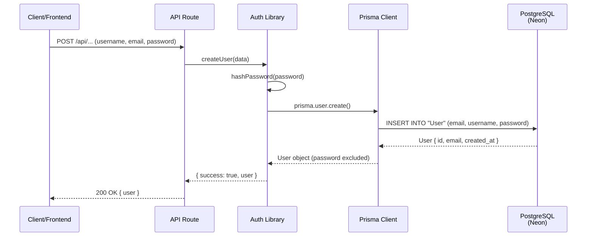
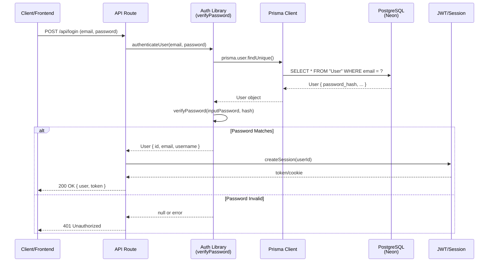
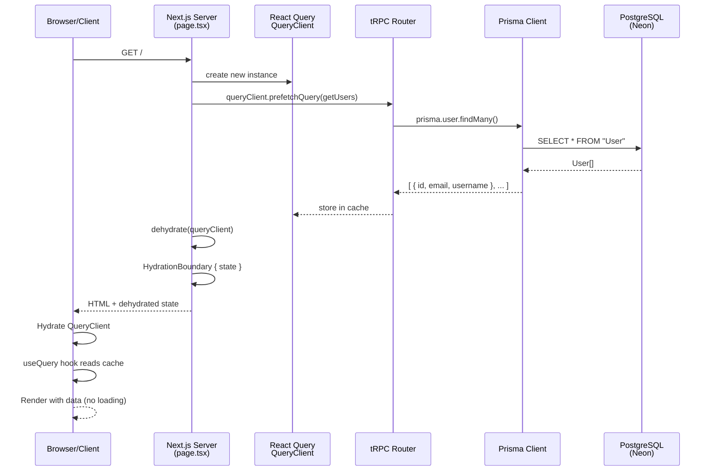
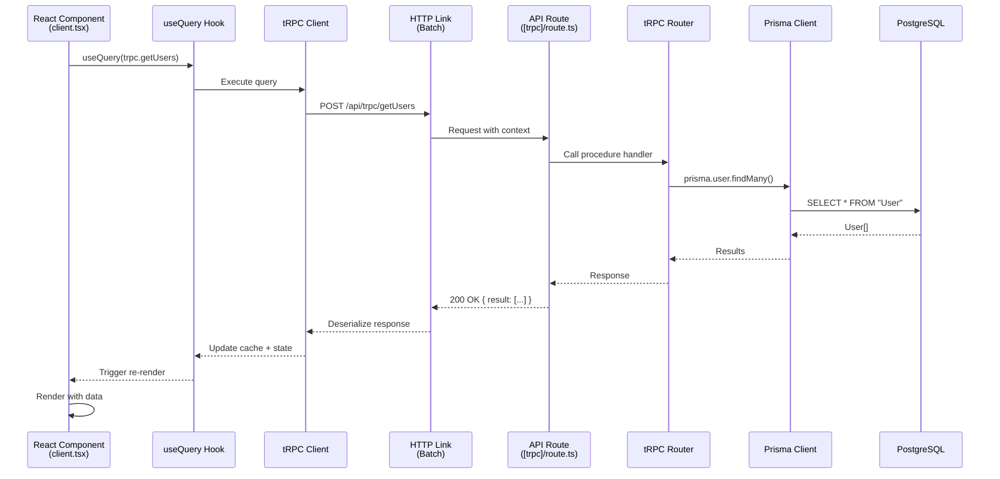
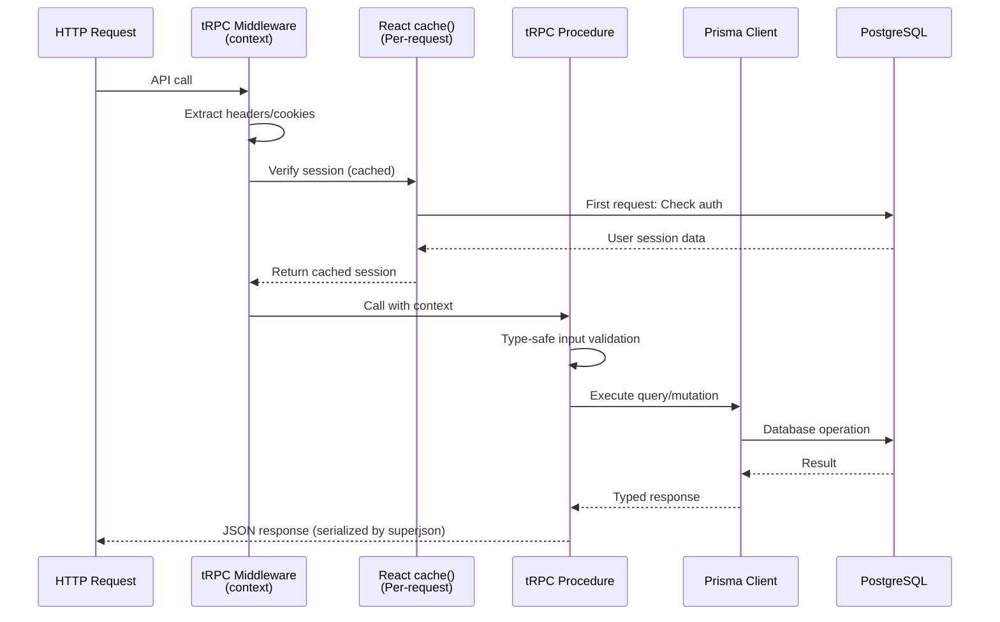
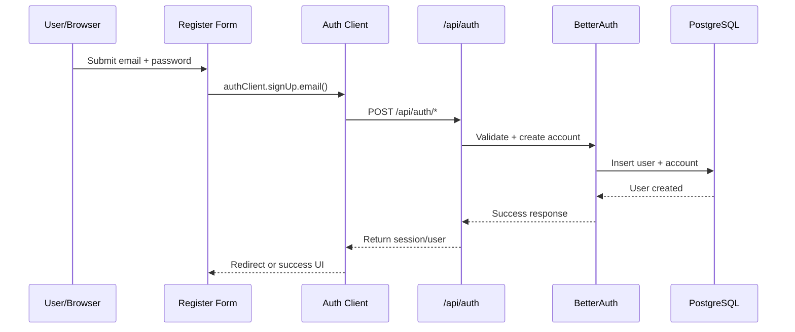

# N8N Clone

A workflow automation platform inspired by n8n. This project enables users to create, manage, and execute complex automation workflows with a visual interface.

## Architecture Overview

This project is structured in progressive architectural layers, where each chapter builds on the previous to create a production-ready workflow automation platform:

- **Chapter 1:** Foundation with Next.js, TypeScript, Tailwind, and project structure.
- **Chapter 2:** Data layer with Prisma and PostgreSQL. Sequence diagrams show secure user creation and authentication flows.
- **Chapter 3:** End-to-end type safety with tRPC. Diagrams illustrate server-side prefetching, client-side queries, hydration, and per-request context.
- **Chapter 4:** Authentication with BetterAuth. Diagrams demonstrate login, registration, session validation, and protected procedure middleware.
- **Chapter 5:** UI/UX improvements with theming and branding.
- **Chapter 6:** Background jobs with Inngest. Sequence shows API event triggering → worker processing → database interaction → result return.
- **Chapter 7:** Multi-provider AI (Gemini, OpenAI, Anthropic). Diagram shows provider selection → SDK initialization → model invocation → AI response.
- **Chapter 8:** Observability with Sentry. Diagrams show error/log flows from app → SDK → monitoring dashboard.
- **Chapter 9:** Scalable sidebar layout. Routing flows from user interaction → router → layout rendering.
- **Chapter 10:** Polar payments integration. Secure checkout and billing flow: session validation → checkout session creation → redirect → subscription management.

Together, these chapters form a full-stack SaaS architecture with authentication, background processing, AI, monitoring, and monetization layers working cohesively.

---

## 📚 Development Progress

### Chapter 1: Project Setup ✅
- [x] Initialize Next.js 15.5.4 with Turbopack
- [x] Set up TypeScript configuration
- [x] Configure Biome for linting and formatting
- [x] Install and configure Tailwind CSS v4
- [x] Set up Shadcn UI component library
- [x] Project structure organization

### Chapter 2: Database and ORM ✅
- [x] Set up Prisma ORM (v6.16.3)
- [x] Configure PostgreSQL database (Neon)
- [x] Create database schema (User & Post models)
- [x] Explore Prisma Studio
- [x] Test Prisma API integration
- [x] Database migrations and seeding
#### Sequence Diagram: User Creation & Auth
See: [SEQUENCE_DIAGRAMS.md](SEQUENCE_DIAGRAMS.md#chapter-2-database--orm)

### Chapter 3: tRPC Setup ✅
- [x] Set up tRPC v11
- [x] Create procedures with Prisma API
- [x] Explore tRPC server-side (prefetch, context)
- [x] Explore tRPC client-side (hooks, provider)
- [x] Explore server + client with prefetch (hydration)
- [x] Production-ready configuration
#### Sequence Diagram: Prefetch, Query, Context
See: [SEQUENCE_DIAGRAMS.md](SEQUENCE_DIAGRAMS.md#chapter-3-trpc-setup)

### Chapter 4: Authentication ✅
- [x] Set up BetterAuth v1.3.26
- [x] Add login/register UI
- [x] Add auth utilities
- [x] Protect procedures with sessions
#### Sequence Diagram: Auth Flows
See: [SEQUENCE_DIAGRAMS.md](SEQUENCE_DIAGRAMS.md#chapter-4-authentication-jwtsession-flow)

### Chapter 5: Theme & Styling ✅
- [x] Apply new theme
- [x] Improve auth screens
- [x] Add logos
#### Sequence Diagram: N/A

### Chapter 6: Background Jobs ✅
- [x] Setup Inngest
- [x] Create a background job
- [x] Add mprocs for parallel dev
- [x] Branch and PR created
- [x] Review & merge
#### Sequence Diagram: N/A

### Chapter 7: AI Providers ✅
- [x] Choose AI model(s): Gemini, OpenAI, Anthropic, etc.
- [x] Set up AI SDK(s) and environment variables
- [x] Integrate AI SDK with Inngest background jobs
- [x] Add provider selection logic
- [x] Test AI workflow end-to-end
- [x] Branch and PR created
- [x] Review & merge
#### Sequence Diagram: AI Provider Workflow
See: [SEQUENCE_DIAGRAMS.md](SEQUENCE_DIAGRAMS.md#chapter-7-ai-providers)

### Chapter 8: Error Tracking ✅
- [x] Setup Sentry for error tracking
- [x] Demonstrate session replays
- [x] Demonstrate logs
- [x] Demonstrate AI monitoring
- [x] Branch and PR created
- [x] Review & merge
#### Sequence Diagram: Error Tracking Workflow
See: [SEQUENCE_DIAGRAMS.md](SEQUENCE_DIAGRAMS.md#chapter-8-rate-limiting-middleware-buckets)

### Chapter 9: Sidebar Layout ✅
- [x] Improve file structure for maintainability
- [x] Create placeholder routes for future features
- [x] Implement sidebar layout for dashboard navigation
- [x] Update README to reflect these changes
- [x] Branch and PR created
- [x] Review & merge
#### Sequence Diagram: Sidebar Layout
See: [SEQUENCE_DIAGRAMS.md](SEQUENCE_DIAGRAMS.md#chapter-9-sidebar-layout)

### Chapter 10: Payments ✅
- [x] Setup Polar for payment processing
- [x] Integrate Polar with BetterAuth for secure user validation
- [x] Create checkout flow for users
- [x] Create billing portal for subscription management
- [x] Branch and PR created
- [x] Review & merge
#### Sequence Diagram: Payments Integration
See: [SEQUENCE_DIAGRAMS.md](SEQUENCE_DIAGRAMS.md#chapter-10-payments)

---

## Technical Deep-Dive

### Chapter 2: Database & ORM

#### Prisma Models

```prisma
model User {
  id            String    @id
  name          String
  email         String
  emailVerified Boolean   @default(false)
  image         String?
  createdAt     DateTime  @default(now())
  updatedAt     DateTime  @default(now()) @updatedAt
  sessions      Session[]
  accounts      Account[]

  @@unique([email])
  @@map("user")
}

model Session {
  id        String   @id
  expiresAt DateTime
  token     String
  createdAt DateTime @default(now())
  updatedAt DateTime @updatedAt
  ipAddress String?
  userAgent String?
  userId    String
  user      User     @relation(fields: [userId], references: [id], onDelete: Cascade)

  @@unique([token])
  @@map("session")
}

model Account {
  id                    String    @id
  accountId             String
  providerId            String
  userId                String
  user                  User      @relation(fields: [userId], references: [id], onDelete: Cascade)
  accessToken           String?
  refreshToken          String?
  idToken               String?
  accessTokenExpiresAt  DateTime?
  refreshTokenExpiresAt DateTime?
  scope                 String?
  password              String?
  createdAt             DateTime  @default(now())
  updatedAt             DateTime  @updatedAt

  @@map("account")
}

model Verification {
  id         String   @id
  identifier String
  value      String
  expiresAt  DateTime
  createdAt  DateTime @default(now())
  updatedAt  DateTime @default(now()) @updatedAt

  @@map("verification")
}
```

---

## Sequence Diagrams

All sequence diagrams are maintained in [SEQUENCE_DIAGRAMS.md](SEQUENCE_DIAGRAMS.md) and referenced under each chapter above. For detailed flows, see:
- Chapter 2: User creation, authentication, and Prisma data flows
- Chapter 3: Server-side prefetching, client-side queries, tRPC context
- Chapter 4: Authentication flows (login, registration, session validation, protected procedures)
- Chapter 6: Background job flows
- Chapter 7: AI provider integration
- Chapter 8: Error tracking flows
- Chapter 9: Sidebar layout routing
- Chapter 10: Payments integration, checkout, and billing portal

---

## Available Scripts

- `npm run dev` - Start development server with Turbopack
- `npm run build` - Build for production
- `npm start` - Start production server
- `npm run lint` - Run Biome linter
- `npm run format` - Format code with Biome

---

## Prisma Commands

- `npx prisma studio` - Open Prisma Studio
- `npx prisma generate` - Generate Prisma Client
- `npx prisma db push` - Push schema to database
- `npx prisma migrate dev` - Create and apply migrations
- `npx prisma migrate reset` - Reset database

---

## 📊 Visual Documentation

Comprehensive visual guides and sequence diagrams for understanding the architecture:

- [Sequence Diagrams](SEQUENCE_DIAGRAMS.md) - Complete request/response flows for all chapters
- [Architecture Reference Guide](ARCHITECTURE_REFERENCE.md) - Visual architecture and component relationships
- [Chapter 2 Technical Summary](CHAPTER_2_SUMMARY.md) - Database & ORM deep-dive
- [Chapter 3 Technical Summary](CHAPTER_3_SUMMARY.md) - tRPC Setup deep-dive
- [Chapter 4 Technical Summary](CHAPTER_4_SUMMARY.md) - Authentication deep-dive
- [Chapter 5 Technical Summary](CHAPTER_5_SUMMARY.md) - Theme & styling deep-dive
- [Chapter 6 Technical Summary](CHAPTER_6_SUMMARY.md) - Background Jobs

---

## 🔄 Key Architecture Diagrams

See [SEQUENCE_DIAGRAMS.md](SEQUENCE_DIAGRAMS.md) for all diagrams. Example flows:

### Chapter 2 - User Creation Flow (Database & ORM)



### Chapter 2 - Authentication Flow (Password Verification)



### Chapter 3 - Server-Side Prefetching Flow



### Chapter 3 - Client-Side Query Flow



### Chapter 3 - tRPC Context & Middleware (Per-Request Caching)



### Chapter 4 - Authentication Flows (BetterAuth)



---

## Architecture Comparison

| Aspect | Chapter 2 | Chapter 3 | Chapter 4 | Chapter 5 |
|--------|-----------|----------|-----------|-----------|
| **Type Safety** | Partial (Prisma → API) | End-to-end (DB → Client) | End-to-end (Auth + API) | UI only |
| **API Definition** | Manual routes | tRPC routers | BetterAuth + tRPC | N/A |
| **Client Queries** | fetch() + types | useQuery hooks | authClient + hooks | N/A |
| **Data Format** | JSON | superjson (Dates, BigInt) | Session tokens | N/A |
| **Caching** | Manual | React Query built-in | Session-based | N/A |
| **Server Data** | Separate calls | Prefetch + hydrate | Session validation | N/A |
| **Context Sharing** | Per-route | Middleware + cache | protectedProcedure | N/A |

---

## Project Features

- Visual workflow builder (Coming soon)
- Node-based automation (Coming soon)
- Workflow execution and monitoring (Coming soon)
- Database integration with Prisma ✅
- Type-safe API layer ✅

---

## Development Workflow

1. Create a new branch for each chapter/feature
2. Make changes and test locally
3. Create a Pull Request
4. Review and merge to main

---

## Contributing

Guidelines for contributing to this project.

---

## License

Specify your project license.
