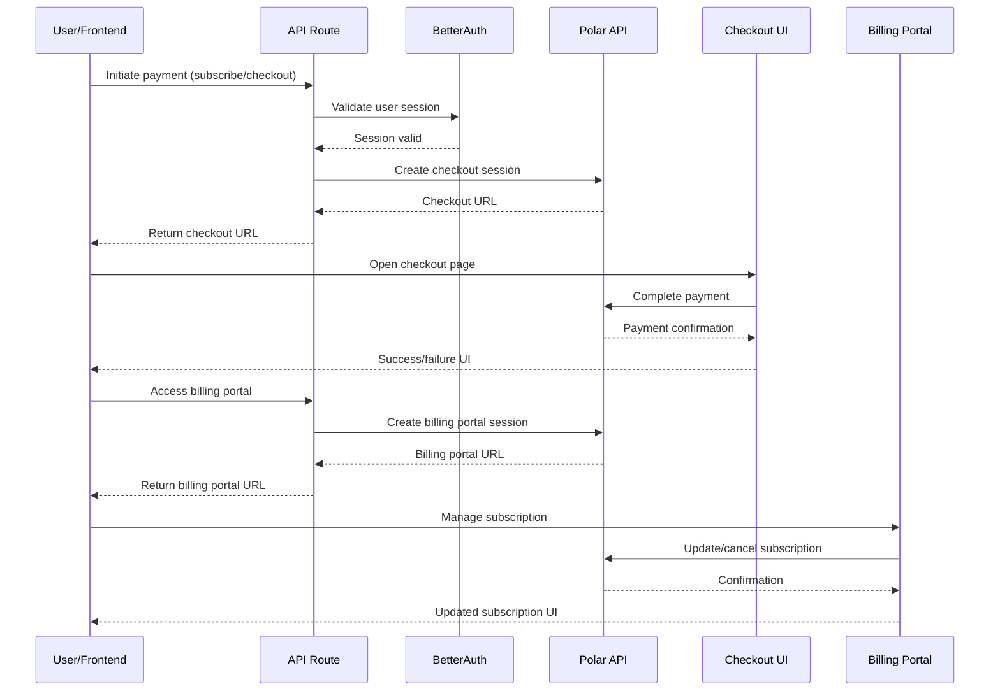

# Sequence Diagrams - Chapter Flow Documentation

This document contains sequence diagrams for all chapters showing data flow, interactions between layers, and request/response handling patterns.

---


## Table of Contents

- [Chapter 2: Database & ORM](#chapter-2-database--orm)
        - [User Creation Flow](#user-creation-flow)
        - [Authentication Flow](#authentication-flow)
        - [Prisma Data Flow Explanation](#prisma-data-flow-explanation)
- [Chapter 3: tRPC Setup](#chapter-3-trpc-setup)
        - [Server-Side Prefetching Flow](#server-side-prefetching-flow)
        - [Client-Side Query Flow](#client-side-query-flow)
        - [tRPC Context & Middleware Flow](#trpc-context--middleware-flow)
        - [Request/Response Architecture](#requestresponse-architecture)
- [Chapter 10: Payments](#chapter-10-payments)
# Chapter 10: Payments

### Payments Integration, Checkout, and Billing Portal



**Key Points:**
- User initiates payment or subscription from the UI
- API validates session with BetterAuth
- Polar API is used to create checkout and billing portal sessions
- User completes payment and manages subscription via Polar-hosted UIs
- All sensitive payment logic handled by Polar

**Files Involved:**
- `/src/lib/polar.ts` - Polar API integration
- `/src/features/subscriptions/` - Subscription logic and hooks
- `/src/app/(dashboard)/` - UI for payments and billing

---

---

## Chapter 2: Database & ORM

### User Creation Flow

```
┌─────────────┐
│   Client    │
│  /Frontend  │
└──────┬──────┘
       │ POST /api/... (username, email, password)
       ▼
┌─────────────────┐
│   API Route     │
└────────┬────────┘
         │ createUser(data)
         ▼
┌──────────────────┐
│  Auth Library    │
│ (hashPassword)   │
└────────┬─────────┘
         │ hashPassword(password)
         │ [Salt: 10 rounds]
         │ prisma.user.create()
         ▼
┌──────────────────┐
│ Prisma Client    │
└────────┬─────────┘
         │ INSERT INTO "User"
         ▼
┌──────────────────────┐
│  PostgreSQL (Neon)   │
│  - Email (unique)    │
│  - Username          │
│  - Password (hashed) │
│  - Created_at        │
└────────┬─────────────┘
         │ User { id, email, created_at }
         ▼
┌──────────────────┐
│ Prisma Client    │
│ (password excl.) │
└────────┬─────────┘
         │ { success: true, user }
         ▼
┌──────────────────┐
│   API Route      │
└────────┬─────────┘
         │ 200 OK { user }
         ▼
┌─────────────────┐
│  Client/Frontend│
└─────────────────┘
```

**Key Points:**
- Password hashing happens in Auth Library using bcrypt (10 salt rounds)
- Prisma queries configured to exclude password from responses
- Database enforces unique constraint on email field
- Created_at timestamp auto-generated by PostgreSQL
- User response never includes password hash

**Files Involved:**
- `/src/lib/password.ts` - Hash/verify functions
- `/src/lib/auth.ts` - createUser helper
- `/prisma/schema.prisma` - User model definition
- `/src/lib/db.ts` - Prisma Client singleton

---

### Authentication Flow

```
┌──────────────┐
│   Client     │
└──────┬───────┘
       │ POST /api/login (email, password)
       ▼
┌──────────────────┐
│   API Route      │
│ (authenticateUser)
└─────────┬────────┘
          │ authenticateUser(email, password)
          ▼
┌──────────────────┐
│  Auth Library    │
└─────────┬────────┘
          │ prisma.user.findUnique(email)
          ▼
┌──────────────────┐
│ Prisma Client    │
└─────────┬────────┘
          │ SELECT * FROM "User" WHERE email = ?
          ▼
┌──────────────────────┐
│  PostgreSQL (Neon)   │
└─────────┬────────────┘
          │ User { password_hash, ... }
          ▼
┌──────────────────┐
│ Prisma Client    │
└─────────┬────────┘
          │ User object
          ▼
┌────────────────────────┐
│  Auth Library          │
│ verifyPassword()       │
│ [bcrypt.compare()]     │
└──────────┬─────────────┘
           │
       ┌───┴────┐
       │         │
   Match    Mismatch
       │         │
       ▼         ▼
   Auth OK   401 Unauth
       │         │
       ▼         ▼
┌──────────────┐ ┌──────────┐
│ createSession│ │  API Err │
│ (JWT/Cookie) │ └──────────┘
└──────┬───────┘
       │ token/session
       ▼
┌──────────────────┐
│   API Response   │
│ 200 OK { user }  │
└──────┬───────────┘
       │
       ▼
┌──────────────┐
│   Client     │
└──────────────┘
```

**Key Points:**
- Email is indexed in database for fast lookups
- Password verification never stored in response
- bcrypt.compare() is timing-safe against attacks
- Session/token created on successful authentication
- Failed auth returns 401 without leaking user existence

**Files Involved:**
- `/src/lib/password.ts` - verifyPassword function
- `/src/lib/auth.ts` - authenticateUser helper
- `/src/lib/test-helpers.ts` - Test user creation

---

### Prisma Data Flow Explanation

**Setup:**
```typescript
// prisma/schema.prisma
datasource db {
  provider = "postgresql"
  url      = env("DATABASE_URL") // Neon Cloud
}

model User {
  id        Int     @id @default(autoincrement())
  email     String  @unique
  username  String
  password  String  // bcrypt hash
  createdAt DateTime @default(now()) @map("created_at")
  posts     Post[]  // one-to-many relationship
}

model Post {
  id        Int     @id @default(autoincrement())
  title     String
  content   String
  userId    Int
  user      User    @relation(fields: [userId], references: [id])
  createdAt DateTime @default(now()) @map("created_at")
}
```

**Singleton Pattern (per-request caching):**
```typescript
// src/lib/db.ts
import { PrismaClient } from "@prisma/client";

const globalForPrisma = global as unknown as {
  prisma: PrismaClient | undefined;
};

export const prisma =
  globalForPrisma.prisma ??
  new PrismaClient({
    log: ["warn", "error"],
  });

if (process.env.NODE_ENV !== "production") {
  globalForPrisma.prisma = prisma;
}
```

**Why Singleton:**
- Prevents creating multiple PrismaClient instances in development (which causes hot-reload errors)
- In production, uses a single shared instance
- Connection pooling handled by Neon serverless driver

**Query Patterns:**

| Operation | Pattern | Example |
|-----------|---------|---------|
| Create | prisma.model.create() | `prisma.user.create({ data })` |
| Read | prisma.model.findUnique() | `prisma.user.findUnique({ where: { email } })` |
| Read Many | prisma.model.findMany() | `prisma.user.findMany()` |
| Update | prisma.model.update() | `prisma.user.update({ where, data })` |
| Delete | prisma.model.delete() | `prisma.user.delete({ where })` |
| Relations | Include nested | `prisma.user.findMany({ include: { posts: true } })` |

---

## Chapter 3: tRPC Setup

### Server-Side Prefetching Flow

```
Browser Request (GET /)
         │
         ▼
┌──────────────────────────┐
│  Next.js Server          │
│  (page.tsx SSR)          │
└────────┬─────────────────┘
         │
         ▼
┌──────────────────────────┐
│  Create QueryClient      │
│  (React Query)           │
│  - staleTime: 30s        │
│  - Dehydration enabled   │
└────────┬─────────────────┘
         │
         ▼
┌──────────────────────────┐
│  Prefetch getUsers       │
│ queryClient.prefetchQuery│
│ (getUsers.queryOptions)  │
└────────┬─────────────────┘
         │
         ▼
┌──────────────────────────┐
│  tRPC Router             │
│  getUsers procedure      │
│  (baseProcedure.query)   │
└────────┬─────────────────┘
         │
         ▼
┌──────────────────────────┐
│  Prisma Client           │
│ prisma.user.findMany()   │
└────────┬─────────────────┘
         │
         ▼
┌──────────────────────────┐
│  PostgreSQL (Neon)       │
│  SELECT * FROM "User"    │
└────────┬─────────────────┘
         │
         ▼
┌──────────────────────────┐
│  Prisma Returns Data     │
│  User[]                  │
└────────┬─────────────────┘
         │
         ▼
┌──────────────────────────┐
│  tRPC Router             │
│  Serialize (superjson)   │
└────────┬─────────────────┘
         │
         ▼
┌──────────────────────────┐
│  React Query             │
│  Store in cache          │
│  queryClient.setQueryData│
└────────┬─────────────────┘
         │
         ▼
┌──────────────────────────┐
│  Server Render           │
│ dehydrate(queryClient)   │
│ Extract cache state      │
└────────┬─────────────────┘
         │
         ▼
┌──────────────────────────┐
│  HTML Response           │
│  + Dehydrated state JSON │
│  <HydrationBoundary>     │
└────────┬─────────────────┘
         │
         ▼
┌──────────────────────────┐
│  Browser Receives HTML   │
└────────┬─────────────────┘
         │
         ▼
┌──────────────────────────┐
│  Client Hydration        │
│ Restore QueryClient      │
│ from dehydrated state    │
└────────┬─────────────────┘
         │
         ▼
┌──────────────────────────┐
│  React Renders           │
│  useQuery hook reads     │
│  cache (no loading)      │
│  Data visible immediately│
└────────┬─────────────────┘
         │
         ▼
┌──────────────────────────┐
│  Page Displayed          │
│  Zero CLS (Layout Shift) │
└──────────────────────────┘
```

**Key Benefits:**
- **Zero Loading State**: Data available on page load
- **No Network Waterfall**: Database query happens on server
- **Faster LCP (Largest Contentful Paint)**: HTML includes data
- **Better UX**: Instant page content display
- **Type Safety**: tRPC ensures types match client/server

**Code Example:**
```typescript
// src/app/page.tsx
const queryClient = getQueryClient();
await queryClient.prefetchQuery(
  trpc.getUsers.queryOptions()
);

const dehydrated = dehydrate(queryClient);

return (
  <HydrationBoundary state={dehydrated}>
    <Client />
  </HydrationBoundary>
);
```

---

### Client-Side Query Flow

```
┌────────────────────┐
│  React Component   │
│  (use 'use client')│
│  renders useQuery  │
└───────┬────────────┘
        │
        ▼
┌────────────────────────────┐
│ useQuery Hook              │
│ (from @trpc/react-query)   │
│ trpc.getUsers.useQuery()   │
└───────┬────────────────────┘
        │
        ▼
┌────────────────────────────┐
│ tRPC React Client          │
│ HTTP Link (batch mode)     │
│ Enabled by default         │
└───────┬────────────────────┘
        │
        ▼
┌────────────────────────────┐
│ Fetch/HTTP Request         │
│ POST /api/trpc/[getUsers]  │
│ Content-Type: application/ │
│ json                       │
└───────┬────────────────────┘
        │
        ▼
┌────────────────────────────────┐
│ API Route Handler              │
│ (src/app/api/trpc/[trpc]/     │
│  route.ts)                    │
│ Dynamic catch-all route        │
└────────┬───────────────────────┘
         │
         ▼
┌────────────────────────────┐
│ tRPC Request Handler       │
│ Parse tRPC call metadata   │
│ Extract context            │
└───────┬────────────────────┘
        │
        ▼
┌────────────────────────────┐
│ tRPC Router                │
│ Match procedure: getUsers  │
│ Validate inputs (Zod)      │
└───────┬────────────────────┘
        │
        ▼
┌────────────────────────────┐
│ Procedure Handler          │
│ baseProcedure.query()      │
│ Execute business logic     │
└───────┬────────────────────┘
        │
        ▼
┌────────────────────────────┐
│ Prisma Query               │
│ prisma.user.findMany()     │
└───────┬────────────────────┘
        │
        ▼
┌────────────────────────────┐
│ PostgreSQL (Neon)          │
│ Execute SQL query          │
│ Return User[]              │
└───────┬────────────────────┘
        │
        ▼
┌────────────────────────────┐
│ Prisma Response            │
│ User[] with all fields     │
└───────┬────────────────────┘
        │
        ▼
┌────────────────────────────┐
│ tRPC Router                │
│ Type-check response        │
│ Serialize (superjson)      │
└───────┬────────────────────┘
        │
        ▼
┌────────────────────────────┐
│ HTTP Response              │
│ 200 OK                     │
│ { result: { data: [...] }} │
└───────┬────────────────────┘
        │
        ▼
┌────────────────────────────┐
│ tRPC Client                │
│ Deserialize (superjson)    │
│ Type validation            │
└───────┬────────────────────┘
        │
        ▼
┌────────────────────────────┐
│ React Query                │
│ Update cache               │
│ setQueryData()             │
│ Trigger subscribers        │
└───────┬────────────────────┘
        │
        ▼
┌────────────────────────────┐
│ Component Re-render        │
│ useQuery returns new data  │
│ isLoading = false          │
│ isError = false            │
│ data = User[]              │
└───────┬────────────────────┘
        │
        ▼
┌────────────────────────────┐
│ UI Renders                 │
│ Display user list          │
│ No loading spinner         │
└────────────────────────────┘
```

**Key Points:**
- **Batching**: Multiple queries sent in single HTTP request
- **Caching**: React Query prevents duplicate requests
- **Type Safety**: Response validated against Zod schemas
- **Error Handling**: Network errors caught and returned
- **Loading States**: Component state managed automatically

---

### tRPC Context & Middleware Flow

```
HTTP Request Arrives
     │
     ▼
┌────────────────────────┐
│ Middleware (context)   │
│ Extract headers/cookies│
│ Create auth context    │
└─────────┬──────────────┘
          │
          ▼
┌────────────────────────┐
│ React cache()          │
│ (Per-request singleton)│
│ Check if already called│
└─────────┬──────────────┘
          │
    ┌─────┴─────┐
    │           │
First Call  Cached
    │           │
    ▼           ▼
┌──────┐   ┌──────────┐
│ DB   │   │Return    │
│Query │   │cached    │
└──┬───┘   │data      │
   │       └──────────┘
   ▼
SELECT ... (session lookup)
   │
   ▼
┌─────────────────────┐
│Database Response    │
│session/user data    │
└──────────┬──────────┘
           │
           ▼
┌─────────────────────┐
│Cache Result         │
│in React cache()     │
└──────────┬──────────┘
           │
           ▼
┌─────────────────────────┐
│Return Context Object    │
│{ session, user, db }    │
└──────────┬──────────────┘
           │
           ▼
┌──────────────────────────┐
│Procedure Handler         │
│Receives typed context    │
│Can access session/user   │
└──────────┬───────────────┘
           │
           ▼
┌──────────────────────────┐
│Execute Business Logic    │
│(Prisma queries, etc)     │
└──────────┬───────────────┘
           │
           ▼
┌──────────────────────────┐
│Return Typed Response     │
│Validated by Zod schema   │
└──────────┬───────────────┘
           │
           ▼
┌──────────────────────────┐
│HTTP Response             │
│200 OK { result: ... }    │
└──────────────────────────┘
```

**Context Pattern:**
```typescript
// src/trpc/init.ts
import { cache } from "react";

export const createContextQuery = cache(async () => {
  // This runs once per request
  // Subsequent calls return cached result
  const session = await validateSession();
  const user = await getUserData(session);
  return { session, user };
});

export const createContext = async () => {
  const context = await createContextQuery();
  return context;
};
```

**Why React cache()?**
- Deduplicates identical context queries per request
- Prevents multiple DB hits for session validation
- Thread-safe per-request singleton
- Works across SSR and API routes

---

### Request/Response Architecture

```
┌─────────────────────────────────────────────────────────────┐
│                        CLIENT LAYER                          │
│  React Component → useQuery Hook → tRPC Client              │
│                                                              │
│  HTTP Link (batch) → Fetch API → POST /api/trpc/[trpc]     │
└─────────────────────┬─────────────────────────────────────┘
                      │
                      │ HTTP POST with body:
                      │ {
                      │   "0": {
                      │     "jsonrpc": "2.0",
                      │     "method": "query",
                      │     "params": {"path":"getUsers","input":null},
                      │     "id": 1
                      │   }
                      │ }
                      │
                      ▼
┌─────────────────────────────────────────────────────────────┐
│                      NETWORK LAYER                           │
│              (tRPC HTTP Transport Protocol)                 │
└─────────────────────┬────────────────────────────────────┬──┘
                      │ Request                    Response │
                      │                                    │
                      ▼                                    │
┌─────────────────────────────────────────────────────────┐  │
│                      SERVER LAYER                       │  │
│                                                          │  │
│  API Route ([trpc]/route.ts)                            │  │
│    ↓                                                    │  │
│  tRPC Request Handler                                   │  │
│    ↓                                                    │  │
│  Context Builder (cache + middleware)                   │  │
│    ↓                                                    │  │
│  Router + Procedure Matching                            │  │
│    - Validate inputs (Zod)                              │  │
│    - Type-check context                                 │  │
│    ↓                                                    │  │
│  Procedure Handler                                      │  │
│    - Execute business logic                             │  │
│    - Prisma queries                                     │  │
│    ↓                                                    │  │
│  Serialization (superjson)                              │  │
│    - Date → ISO string                                  │  │
│    - BigInt → serialized                                │  │
│    ↓                                                    │  │
│  HTTP Response (200/400/500)                            │  │
│    {                                                    │  │
│      "0": {                                             │  │
│        "result": {                                      │  │
│          "data": [{"id":1,"email":"...",})              │  │
│        }                                                │  │
│      }                                                  │  │
│    }                                                    │  │
│                                                          │  │
└─────────────────────────────────────────────────────────┘  │
                                                              │
                              ←─────────────────────────────┘
                                │
                                ▼
                      ┌──────────────────────┐
                      │ Client Deserialization
                      │ (superjson)          │
                      │                      │
                      │ Extract data from    │
                      │ response             │
                      └──────────┬───────────┘
                                 │
                                 ▼
                      ┌──────────────────────┐
                      │ React Query Cache    │
                      │ Update cache state   │
                      │ Trigger subscribers  │
                      └──────────┬───────────┘
                                 │
                                 ▼
                      ┌──────────────────────┐
                      │ Component Re-render  │
                      │ useQuery returns:    │
                      │ - data               │
                      │ - isLoading          │
                      │ - error              │
                      └──────────────────────┘
```

**Serialization Rules (superjson):**

| Type | Serialized As | Notes |
|------|---|---|
| Date | ISO 8601 string | `"2026-02-22T10:30:00Z"` |
| BigInt | `{ type: "bigint", value: "..." }` | Preserves precision |
| Map | `{ type: "map", entries: [...] }` | Re-hydrates as Map |
| Set | `{ type: "set", values: [...] }` | Re-hydrates as Set |
| Undefined | `{ type: "undefined" }` | Distinguishes from null |
| Error | `{ message, stack }` | Preserves error context |

**Type Flow:**
```
Database Schema (Prisma)  →  TypeScript Types  →  Zod Schemas  →  tRPC Router
        ↓                         ↓                      ↓               ↓
    User model              User type               input validation    procedure
       │                        │                       │                │
       └────────────────────────┴───────────────────────┴────────────────┘
                         (All types flow end-to-end)
                                   │
                                   ▼
                         Browser gets TypeScript
                         intellisense for response
```

---

## Architecture Summary

### Chapter 2: Traditional Data Flow
```
Frontend API Call → Server Handler → Auth Validation → Prisma Query → Database
                                ↓
                         Bcrypt Password Check
                                ↓
                         Return Typed Response
```

### Chapter 3: Type-Safe API Layer
```
Frontend Hook → tRPC Client → HTTP Batching → API Route → Context (cached) → Router
                                                              ↓
                                                         Procedure Handler
                                                              ↓
                                                        Prisma Query
                                                              ↓
                                                           Database
                                                              ↓
                                                      Response Serialization
                                                              ↓
                                                        React Query Cache
                                                              ↓
                                                       Component Re-render
```

### Key Architectural Benefits

| Aspect | Chapter 2 | Chapter 3 | Benefit |
|--------|-----------|----------|---------|
| **Type Safety** | Partial | End-to-end | No runtime type errors |
| **API Definition** | Manual routes | Routers + Procedures | DRY principle |
| **Client Query** | fetch() + types | useQuery hook | Less boilerplate |
| **Data Format** | Custom JSON | superjson | Complex types supported |
| **Caching** | Manual | React Query | Built-in optimization |
| **Server-side Data** | Separate fetching | Prefetch + Hydrate | Zero loading states |
| **Context Sharing** | Per-route setup | Middleware + cache | Efficient sharing |

---

## Testing Sequence Diagrams

### Chapter 2: Test User Creation
```
Test Harness
    │
    ▼
createTestUser({ username, email, password })
    │
    ▼
hashPassword(password, 10 rounds)
    │
    ▼
prisma.user.create()
    │
    ▼
Database INSERT
    │
    ▼
Return User { id, userName, email, password: hash }
    │
    ▼
✓ User created without being exposed
```

### Chapter 3: Test Procedure
```
Test Client
    │
    ▼
trpc.getUsers.createCaller(context)
    │
    ▼
Procedure executes server-side
    │
    ▼
prisma.user.findMany()
    │
    ▼
Results returned with types
    │
    ▼
✓ No HTTP involved, direct function calls
```

---

## Performance Metrics

### Chapter 2: Typical Request
- Database query: 10-50ms
- Password hashing (new user): 100-200ms
- Password verification: 100-200ms
- Network round-trip: 50-100ms
- **Total**: ~200-300ms (dependent on password operation)

### Chapter 3: Server-side Prefetch
- Server database query: 10-50ms
- Serialization: 5-20ms
- HTML generation: 20-50ms
- **Total**: ~50-100ms
- **Then browser hydration**: 0ms (data already there)

### Chapter 3: Client-side Query
- Network request: 50-100ms
- Server query: 10-50ms
- Deserialization: 5-20ms
- React re-render: 10-50ms
- **Total**: ~100-200ms (with subsequent caching)

---

## Next Steps & Future Chapters

### Upcoming Diagrams
- **Chapter 4**: Authentication (JWT/Session flow)
- **Chapter 5**: Real-time Updates (WebSockets with tRPC)
- **Chapter 6**: File Uploads (Presigned URLs + S3)
- **Chapter 7**: Caching Strategy (Redis, varnish, CDN)
- **Chapter 8**: Rate Limiting (Middleware, buckets)

### Chapter 7: AI Providers

#### AI Provider Workflow
```
┌─────────────┐
│   User      │
│ /Frontend   │
└─────┬───────┘
        │ Submit workflow (provider/model)
        ▼
┌─────────────────┐
│   API Route     │
└─────┬───────────┘
        │ Trigger Inngest job (provider, input)
        ▼
┌────────────────────┐
│ Inngest Function   │
└─────┬──────────────┘
        │ Initialize AI SDK (env vars)
        ▼
┌────────────────────┐
│ AI Provider SDK    │
└─────┬──────────────┘
        │ Send prompt/input
        ▼
┌────────────────────┐
│ AI Model           │
│ (Gemini/OpenAI/...)│
└─────┬──────────────┘
        │ AI response
        ▼
┌────────────────────┐
│ AI Provider SDK    │
└─────┬──────────────┘
        │ Return result
        ▼
┌────────────────────┐
│ Inngest Function   │
└─────┬──────────────┘
        │ Job complete (result)
        ▼
┌─────────────────┐
│   API Route     │
└─────┬───────────┘
        │ Show AI output
        ▼
┌─────────────┐
│   User      │
└─────────────┘
```

**Key Points:**
- User selects provider/model in the UI
- API triggers Inngest background job with provider info
- Inngest initializes the correct AI SDK using environment variables
- AI SDK sends prompt to the selected model (Gemini, OpenAI, Anthropic, etc.)
- Result is returned to the user after processing

---

### Diagram Conventions
- **Solid arrows (→)**: Synchronous calls
- **Dashed arrows (⇢)**: Asynchronous/promise returns
- **Rounded boxes**: External systems (database, network)
- **Rectangular boxes**: Application components
- **Diamond boxes**: Decision points

---

## Questions & Support

For understanding these flows:
1. Check specific chapter documentation (CHAPTER_2_SUMMARY.md, CHAPTER_3_SUMMARY.md)
2. Trace a real request through the diagram
3. Review relevant source files mentioned
4. Test locally with browser DevTools Network tab

